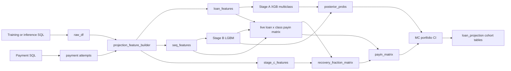

Version: v1 | Date: 2026-04-30 | Repo: yieldCurve_augmenting

# Projection design (status)

## Purpose

End-to-end **payin ratio** projection for a scored loan set: **terminal class mix (Stage A)** × **installment path (Stage B)** × **post-default recovery (Stage C)**, with **Monte Carlo** and **Bayesian-style** update on class probabilities from observed installments. Goal: cohort / portfolio views plus hooks for **operational drivers** (viz, SHAP on frozen heads).

## Pipeline (current)

- **Training:** [`yield_projections_notebooks/jcx_2026_projection_V5.ipynb`](../yield_projections_notebooks/jcx_2026_projection_V5.ipynb) — fit A/B/C, persist run.
- **Inference:** [`yield_projections_notebooks/jcx_2026_projection_inference_V1.ipynb`](../yield_projections_notebooks/jcx_2026_projection_inference_V1.ipynb) — load run, SQL, `score_live_projection` in [`util/projection_inference.py`](../util/projection_inference.py).
- **Eval:** [`yield_projections_notebooks/jcx_2026_eval_v1.ipynb`](../yield_projections_notebooks/jcx_2026_eval_v1.ipynb) — holdout vs realized via [`util/projection_evaluation.py`](../util/projection_evaluation.py).

## Persistence

[`util/projection_model_persistence.py`](../util/projection_model_persistence.py) — folder `prediction_models/runs/{UTC_tag}/`:

| File | Role |
|------|------|
| `stage_a/model.json` | XGBoost booster |
| `stage_b/classifier.txt`, `regressor.txt` | LightGBM |
| `stage_c/classifier.txt`, `regressor.txt` | LightGBM recovery |
| `feature_contract.json` | Feature lists, `class_order`, `category_maps`, Stage C min days, payment-history names |
| `metadata.json`, `metrics.json`, `artifacts/artifacts.json` | Run metadata, `recovery_by_class` fallback (see loader), other run-scoped JSON |

Loader: `load_projection_run(project_root, run_tag)` → `ProjectionModelRun`.

## Inference contract (as-of)

- `as_of_date` caps realized cash, flags, and payment attempts via [`projection_feature_builder._prepare_raw_as_of`](../util/projection_feature_builder.py).
- **Inference SQL** (recent cohort, full schedule): [`sql_scripts/jcx_raw_inference_v1.sql`](../sql_scripts/jcx_raw_inference_v1.sql), [`sql_scripts/SP_payment_data_inference_v1.sql`](../sql_scripts/SP_payment_data_inference_v1.sql). Training uses `jcx_raw_harvey_v14.sql` + `SP_payment_data_v1.sql`.

## Outputs (notebook-level)

- `results`: `loan_features`, `seq_features`, `stage_c_features`, `prior_probs`, `posterior_probs`, `payin_matrix`, `payin_matrix_pre_recovery`, `loan_projection`, `portfolio_ci`, `qc`.
- **Charts:** [`util/projection_visuals.py`](../util/projection_visuals.py) — vintage + decomposition; [`util/projection_visuals_by_custtype.py`](../util/projection_visuals_by_custtype.py) — NEW/RETURN facets.
- **SHAP (light):** [`util/projection_shap_inference.py`](../util/projection_shap_inference.py) — mean \|SHAP\| bars for Stage A (multiclass aggregate), Stage B clf, Stage C clf on inference rows (B/C subsampled); optional single-loan Stage A drill-down. Not full composed posterior.

## Known gaps / follow-ups

| Item | Status |
|------|--------|
| Live matrix future rows use `e_amount_if_collected` not unconditional `p_collected × e_amount_if_collected` | **Open** — see `build_live_loan_class_payin_matrix` in [`util/projection_simulator.py`](../util/projection_simulator.py) |
| Floor class-conditional paths at realized-to-date for inference | **Open** — verify product need vs current `clip(lower=0)` only |
| Posterior drivers vs Stage A prior SHAP | **Out of scope** for current SHAP helper — composed update not explained as single TreeSHAP |

## Plan lineage (detail lives here)

- [`.cursor/plans/inference_pipeline_7f27c6d0.plan.md`](../.cursor/plans/inference_pipeline_7f27c6d0.plan.md) — inference goals, day-0, category maps, live matrix intent.
- [`.cursor/plans/stage_c_recovery_9a3db458.plan.md`](../.cursor/plans/stage_c_recovery_9a3db458.plan.md) — Stage C Option 2, `recovery_fraction_matrix`.
- [`.cursor/plans/payin_projection_v1_plan_bf451ad6.plan.md`](../.cursor/plans/payin_projection_v1_plan_bf451ad6.plan.md) — early V1 Cox/Ridge arc; **superseded** by V5 stack.

## See also

- [0430_projection_features_v1.md](0430_projection_features_v1.md) — feature lists and leakage.
